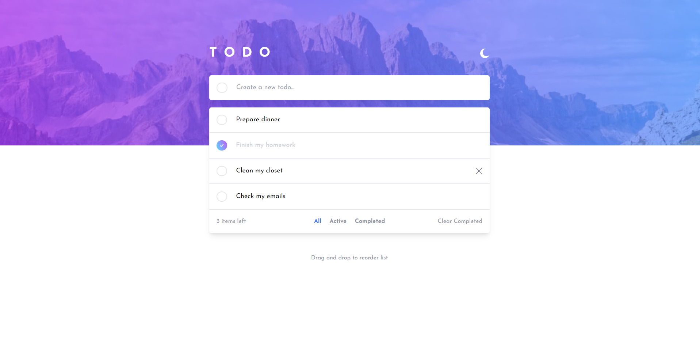

# Todo App

## Description

This a Todo App where people can do the following things:

- Create new todo
- Mark todo as completed
- Unmark todo as completed
- Delete todos from the list
- Delete all the completed todos
- Filter todos by: All, Active and Completed
- Enable or disable Dark Mode
- Drag and drop to reorder items on the list

If you want to test it in real time: https://alexc01.github.io/To-Do-List/